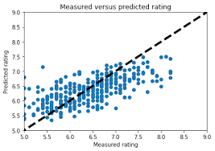

# Movie Rating Prediction Model
The Movie Rating Prediction Model is a machine learning project designed to predict movie ratings based on a variety of features extracted from movie metadata and user interactions. This project leverages historical data to forecast how audiences might rate movies they haven't seen yet, ultimately aiding in personalized movie recommendations and enhancing the user experience on streaming platforms.

## Key Features:

Data-Driven Insights: Utilizes large-scale datasets (e.g., MovieLens, IMDb) containing user ratings, movie genres, cast information, and other relevant metadata.
Advanced Machine Learning Techniques: Implements multiple algorithms including collaborative filtering, content-based filtering, and deep learning methods to improve prediction accuracy.
Data Preprocessing & Feature Engineering: Involves handling missing data, normalizing features, and creating new variables to capture nuanced patterns in user preferences and movie characteristics.
Performance Evaluation: Employs various metrics such as RMSE (Root Mean Squared Error) and MAE (Mean Absolute Error) to assess the model's performance and ensure robust predictions.
Project Goals:

Personalized Recommendations: Enhance user experience by suggesting movies that align with individual tastes based on predicted ratings.
Understanding User Behavior: Identify key factors that influence movie ratings, offering insights for both content creators and streaming services.
Scalable and Adaptable System: Develop a system that can be easily integrated into existing recommendation engines, with potential to expand into multi-modal data like user reviews and trailers.
## Methodology:

Data Collection: Aggregation of movie rating data along with supplementary information such as genres, release dates, and cast details.
Data Preprocessing: Cleaning and transforming data to handle missing values, normalize features, and encode categorical variables.
Model Selection: Experimentation with various algorithms—from traditional collaborative filtering to state-of-the-art deep learning models—to identify the most effective approach.
Training & Validation: Splitting the dataset into training and testing sets, fine-tuning model parameters, and validating performance using cross-validation techniques.
Deployment: Integrating the trained model into a recommendation system framework that can dynamically predict ratings and provide personalized suggestions.
Applications and Future Work
Streaming Platforms: Enhance recommendation systems to boost user engagement and satisfaction.
Content Curation: Assist content creators in understanding viewer preferences and trends.
## Scalability:

Future iterations could integrate sentiment analysis from user reviews and incorporate additional data sources to further refine predictions.
The Movie Rating Prediction Model illustrates the potential of leveraging machine learning to transform raw data into actionable insights, ultimately revolutionizing how we experience and interact with digital content.
